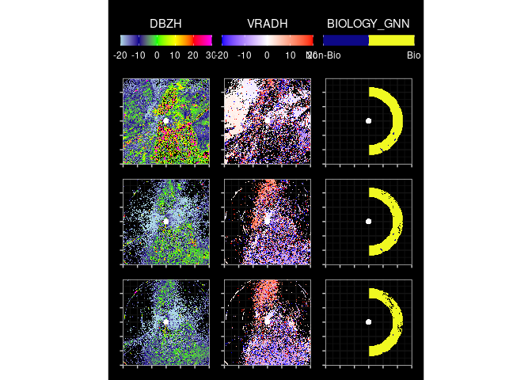

<!-- README.md is generated from README.Rmd. Please edit that file -->

# birdCloudGnnR

<!-- badges: start -->

[](https://CRAN.R-project.org/package=birdCloudGnnR)
<!-- badges: end -->

The goal of birdCloudGnnR is to facilitate using the
[bird-cloud-gnn](https://github.com/point-cloud-radar/bird-cloud-gnn)
model from R.

## Installation

You can install the development version of birdCloudGnnR from
[GitHub](https://github.com/) with:

``` r
# install.packages("devtools")
devtools::install_github("point-cloud-radar/birdCloudGnnR")
```

## Example

This is a basic example which shows you how to solve a common problem:

``` r
devtools::load_all()
#> ℹ Loading birdCloudGnnR
sp::set_evolution_status(2L)
#> The legacy packages maptools, rgdal, and rgeos, underpinning the sp package,
#> which was just loaded, will retire in October 2023.
#> Please refer to R-spatial evolution reports for details, especially
#> https://r-spatial.org/r/2023/05/15/evolution4.html.
#> It may be desirable to make the sf package available;
#> package maintainers should consider adding sf to Suggests:.
#> The sp package is now running under evolution status 2
#>      (status 2 uses the sf package in place of rgdal)
#> [1] 2
require(reticulate)
#> Loading required package: reticulate
require(bioRad)
#> Loading required package: bioRad
#> Welcome to bioRad version 0.7.0.9603
#> Assigning sp_evolution_status to 2. See sp::get_evolution_status()
#> This is required until the 'sp' package deprecates 'rgdal'
require(ggplot2)
#> Loading required package: ggplot2
require(dplyr)
#> Loading required package: dplyr
#> 
#> Attaching package: 'dplyr'
#> 
#> The following object is masked from 'package:testthat':
#> 
#>     matches
#> 
#> The following objects are masked from 'package:stats':
#> 
#>     filter, lag
#> 
#> The following objects are masked from 'package:base':
#> 
#>     intersect, setdiff, setequal, union
pvol_dir <- "~/ownCloudUva/labels/old"
pvol_files <- list.files(pvol_dir, "*.h5$", full.names = TRUE)
file <- pvol_files[1]
pvol <- read_pvolfile(file, param = "all") |>
  select(-any_of(c("CPAH", "SQIH", "CCORH", "SQIV", "CCORV", "UPHIDP")))
r <- pvol_to_dataframe(pvol)

features <- c(
  "range",
  "azimuth",
  "elevation",
  "TH",
  "TV",
  "DBZH",
  "DBZV",
  "RHOHV",
  "VRADH",
  "VRADV",
  "centered_x",
  "centered_y"
)
nrow(r)
#> [1] 1338656
r <- r %>% filter(range < 75000, range > 15000, z < 10000)
nrow(r)
#> [1] 550510
r$BIOLOGY_GNN <- 0 # RadarDataSet selects for existing labels
r$BIOLOGY_GNN <- infer(r, "/home/bart/testModel.pth", features = features)
#> Inferring ■ 1% | ETA: 2hInferring ■■ 3% | ETA: 3hInferring ■■ 4% | ETA:
#> 3hInferring ■■ 5% | ETA: 3hInferring ■■■ 5% | ETA: 3hInferring ■■■ 6% | ETA:
#> 2hInferring ■■■ 7% | ETA: 2hInferring ■■■ 8% | ETA: 2hInferring ■■■■ 9% | ETA:
#> 2hInferring ■■■■ 10% | ETA: 2hInferring ■■■■ 11% | ETA: 2hInferring ■■■■■ 12% |
#> ETA: 1hInferring ■■■■■ 13% | ETA: 1hInferring ■■■■■ 14% | ETA: 1hInferring
#> ■■■■■ 14% | ETA: 1hInferring ■■■■■■ 15% | ETA: 1hInferring ■■■■■■ 16% | ETA:
#> 1hInferring ■■■■■■ 17% | ETA: 1hInferring ■■■■■■ 18% | ETA: 1hInferring ■■■■■■■
#> 19% | ETA: 1hInferring ■■■■■■■ 20% | ETA: 1hInferring ■■■■■■■ 21% | ETA:
#> 1hInferring ■■■■■■■ 22% | ETA: 1hInferring ■■■■■■■■ 23% | ETA: 1hInferring
#> ■■■■■■■■ 23% | ETA: 1hInferring ■■■■■■■■ 24% | ETA: 1hInferring ■■■■■■■■■ 25% |
#> ETA: 1hInferring ■■■■■■■■■ 26% | ETA: 1hInferring ■■■■■■■■■ 27% | ETA:
#> 1hInferring ■■■■■■■■■ 28% | ETA: 1hInferring ■■■■■■■■■■ 29% | ETA: 1hInferring
#> ■■■■■■■■■■ 30% | ETA: 50mInferring ■■■■■■■■■■ 31% | ETA: 48mInferring
#> ■■■■■■■■■■ 32% | ETA: 47mInferring ■■■■■■■■■■■ 32% | ETA: 46mInferring
#> ■■■■■■■■■■■ 33% | ETA: 45mInferring ■■■■■■■■■■■ 34% | ETA: 44mInferring
#> ■■■■■■■■■■■■ 35% | ETA: 44mInferring ■■■■■■■■■■■■ 36% | ETA: 43mInferring
#> ■■■■■■■■■■■■ 37% | ETA: 42mInferring ■■■■■■■■■■■■ 38% | ETA: 41mInferring
#> ■■■■■■■■■■■■■ 39% | ETA: 40mInferring ■■■■■■■■■■■■■ 40% | ETA: 39mInferring
#> ■■■■■■■■■■■■■ 41% | ETA: 38mInferring ■■■■■■■■■■■■■ 41% | ETA: 38mInferring
#> ■■■■■■■■■■■■■■ 42% | ETA: 37mInferring ■■■■■■■■■■■■■■ 43% | ETA: 36mInferring
#> ■■■■■■■■■■■■■■ 44% | ETA: 36mInferring ■■■■■■■■■■■■■■■ 45% | ETA: 35mInferring
#> ■■■■■■■■■■■■■■■ 46% | ETA: 34mInferring ■■■■■■■■■■■■■■■ 47% | ETA: 33mInferring
#> ■■■■■■■■■■■■■■■ 48% | ETA: 32mInferring ■■■■■■■■■■■■■■■■ 49% | ETA:
#> 32mInferring ■■■■■■■■■■■■■■■■ 50% | ETA: 31mInferring ■■■■■■■■■■■■■■■■ 50% |
#> ETA: 30mInferring ■■■■■■■■■■■■■■■■ 51% | ETA: 30mInferring ■■■■■■■■■■■■■■■■■
#> 52% | ETA: 29mInferring ■■■■■■■■■■■■■■■■■ 53% | ETA: 29mInferring
#> ■■■■■■■■■■■■■■■■■ 54% | ETA: 28mInferring ■■■■■■■■■■■■■■■■■ 55% | ETA:
#> 27mInferring ■■■■■■■■■■■■■■■■■■ 56% | ETA: 27mInferring ■■■■■■■■■■■■■■■■■■ 57%
#> | ETA: 26mInferring ■■■■■■■■■■■■■■■■■■ 58% | ETA: 25mInferring
#> ■■■■■■■■■■■■■■■■■■■ 59% | ETA: 25mInferring ■■■■■■■■■■■■■■■■■■■ 59% | ETA:
#> 24mInferring ■■■■■■■■■■■■■■■■■■■ 60% | ETA: 24mInferring ■■■■■■■■■■■■■■■■■■■
#> 61% | ETA: 23mInferring ■■■■■■■■■■■■■■■■■■■■ 62% | ETA: 22mInferring
#> ■■■■■■■■■■■■■■■■■■■■ 63% | ETA: 22mInferring ■■■■■■■■■■■■■■■■■■■■ 64% | ETA:
#> 21mInferring ■■■■■■■■■■■■■■■■■■■■ 65% | ETA: 20mInferring ■■■■■■■■■■■■■■■■■■■■■
#> 66% | ETA: 20mInferring ■■■■■■■■■■■■■■■■■■■■■ 67% | ETA: 19mInferring
#> ■■■■■■■■■■■■■■■■■■■■■ 68% | ETA: 19mInferring ■■■■■■■■■■■■■■■■■■■■■■ 68% | ETA:
#> 18mInferring ■■■■■■■■■■■■■■■■■■■■■■ 69% | ETA: 18mInferring
#> ■■■■■■■■■■■■■■■■■■■■■■ 70% | ETA: 17mInferring ■■■■■■■■■■■■■■■■■■■■■■ 71% |
#> ETA: 17mInferring ■■■■■■■■■■■■■■■■■■■■■■■ 72% | ETA: 16mInferring
#> ■■■■■■■■■■■■■■■■■■■■■■■ 73% | ETA: 16mInferring ■■■■■■■■■■■■■■■■■■■■■■■ 74% |
#> ETA: 15mInferring ■■■■■■■■■■■■■■■■■■■■■■■ 75% | ETA: 14mInferring
#> ■■■■■■■■■■■■■■■■■■■■■■■■ 76% | ETA: 14mInferring ■■■■■■■■■■■■■■■■■■■■■■■■ 77% |
#> ETA: 13mInferring ■■■■■■■■■■■■■■■■■■■■■■■■ 77% | ETA: 13mInferring
#> ■■■■■■■■■■■■■■■■■■■■■■■■■ 78% | ETA: 12mInferring ■■■■■■■■■■■■■■■■■■■■■■■■■ 79%
#> | ETA: 12mInferring ■■■■■■■■■■■■■■■■■■■■■■■■■ 80% | ETA: 11mInferring
#> ■■■■■■■■■■■■■■■■■■■■■■■■■ 81% | ETA: 11mInferring ■■■■■■■■■■■■■■■■■■■■■■■■■■
#> 82% | ETA: 10mInferring ■■■■■■■■■■■■■■■■■■■■■■■■■■ 83% | ETA: 10mInferring
#> ■■■■■■■■■■■■■■■■■■■■■■■■■■ 84% | ETA: 9mInferring ■■■■■■■■■■■■■■■■■■■■■■■■■■
#> 85% | ETA: 9mInferring ■■■■■■■■■■■■■■■■■■■■■■■■■■■ 86% | ETA: 8mInferring
#> ■■■■■■■■■■■■■■■■■■■■■■■■■■■ 86% | ETA: 8mInferring ■■■■■■■■■■■■■■■■■■■■■■■■■■■
#> 87% | ETA: 7mInferring ■■■■■■■■■■■■■■■■■■■■■■■■■■■ 88% | ETA: 7mInferring
#> ■■■■■■■■■■■■■■■■■■■■■■■■■■■■ 89% | ETA: 6mInferring
#> ■■■■■■■■■■■■■■■■■■■■■■■■■■■■ 90% | ETA: 6mInferring
#> ■■■■■■■■■■■■■■■■■■■■■■■■■■■■ 91% | ETA: 5mInferring
#> ■■■■■■■■■■■■■■■■■■■■■■■■■■■■■ 92% | ETA: 5mInferring
#> ■■■■■■■■■■■■■■■■■■■■■■■■■■■■■ 93% | ETA: 4mInferring
#> ■■■■■■■■■■■■■■■■■■■■■■■■■■■■■ 94% | ETA: 4mInferring
#> ■■■■■■■■■■■■■■■■■■■■■■■■■■■■■ 95% | ETA: 3mInferring
#> ■■■■■■■■■■■■■■■■■■■■■■■■■■■■■■ 95% | ETA: 3mInferring
#> ■■■■■■■■■■■■■■■■■■■■■■■■■■■■■■ 96% | ETA: 2mInferring
#> ■■■■■■■■■■■■■■■■■■■■■■■■■■■■■■ 97% | ETA: 2mInferring
#> ■■■■■■■■■■■■■■■■■■■■■■■■■■■■■■ 98% | ETA: 1mInferring
#> ■■■■■■■■■■■■■■■■■■■■■■■■■■■■■■■ 99% | ETA: 31s 

pvol2 <- dataframe_into_pvol(r, pvol, to_add = "BIOLOGY_GNN")
e <- unique(get_elevation_angles(pvol2))[1:3]
ppis <- plot_scans_ppis(pvol2, e,
  params = c("DBZH", "VRADH", "BIOLOGY_GNN"),
  range_max = 75000
)

patchwork::wrap_plots(ppis, nrow = length(e)) &
  ggplot2::theme(
    plot.background =
      ggplot2::element_rect(
        fill = "black",
        color = "black"
      )
  )
#> Warning: Removed 37555 rows containing missing values (`geom_raster()`).
#> Warning: Removed 47426 rows containing missing values (`geom_raster()`).
#> Warning: Removed 50279 rows containing missing values (`geom_raster()`).
```


