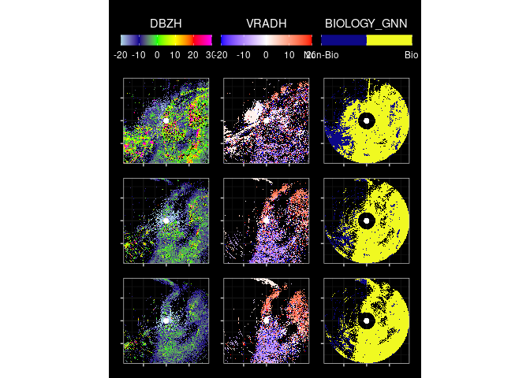

<!-- README.md is generated from README.Rmd. Please edit that file -->

# birdCloudGnnR

<!-- badges: start -->

[](https://CRAN.R-project.org/package=birdCloudGnnR)
<!-- badges: end -->

The goal of birdCloudGnnR is to facilitate using the
[bird-cloud-gnn](https://github.com/point-cloud-radar/bird-cloud-gnn)
model from R.

## Installation

You can install the development version of birdCloudGnnR from
[GitHub](https://github.com/) with:

``` r
# install.packages("devtools")
devtools::install_github("point-cloud-radar/birdCloudGnnR")
```

## Example

This is a basic example which shows you how to solve a common problem:

``` r
devtools::load_all()
#> ℹ Loading birdCloudGnnR
#> The legacy packages maptools, rgdal, and rgeos, underpinning the sp package,
#> which was just loaded, will retire in October 2023.
#> Please refer to R-spatial evolution reports for details, especially
#> https://r-spatial.org/r/2023/05/15/evolution4.html.
#> It may be desirable to make the sf package available;
#> package maintainers should consider adding sf to Suggests:.
#> The sp package is now running under evolution status 2
#>      (status 2 uses the sf package in place of rgdal)
#> 
#> Please note that rgdal will be retired during October 2023,
#> plan transition to sf/stars/terra functions using GDAL and PROJ
#> at your earliest convenience.
#> See https://r-spatial.org/r/2023/05/15/evolution4.html and https://github.com/r-spatial/evolution
#> rgdal: version: 1.6-7, (SVN revision 1203)
#> Geospatial Data Abstraction Library extensions to R successfully loaded
#> Loaded GDAL runtime: GDAL 3.4.1, released 2021/12/27
#> Path to GDAL shared files: /usr/share/gdal
#> GDAL binary built with GEOS: TRUE 
#> Loaded PROJ runtime: Rel. 8.2.1, January 1st, 2022, [PJ_VERSION: 821]
#> Path to PROJ shared files: /home/bart/.local/share/proj:/usr/share/proj
#> PROJ CDN enabled: FALSE
#> Linking to sp version:1.6-1
#> To mute warnings of possible GDAL/OSR exportToProj4() degradation,
#> use options("rgdal_show_exportToProj4_warnings"="none") before loading sp or rgdal.
#> 
#> Please note that 'maptools' will be retired during October 2023,
#> plan transition at your earliest convenience (see
#> https://r-spatial.org/r/2023/05/15/evolution4.html and earlier blogs
#> for guidance);some functionality will be moved to 'sp'.
#>  Checking rgeos availability: FALSE
sp::set_evolution_status(2L)
#> [1] 2
require(reticulate)
#> Loading required package: reticulate
require(bioRad)
#> Loading required package: bioRad
#> Welcome to bioRad version 0.6.2
#> Warning: Docker daemon is not running
#> Warning: bioRad functionality requiring Docker has been disabled
#> 
#> To enable Docker functionality, start Docker and run 'check_docker()'
#> in R
require(ggplot2)
#> Loading required package: ggplot2
require(dplyr)
#> Loading required package: dplyr
#> 
#> Attaching package: 'dplyr'
#> 
#> The following object is masked from 'package:testthat':
#> 
#>     matches
#> 
#> The following objects are masked from 'package:stats':
#> 
#>     filter, lag
#> 
#> The following objects are masked from 'package:base':
#> 
#>     intersect, setdiff, setequal, union
pvol_dir <- "~/ownCloudUva/labels/old"
pvol_files <- list.files(pvol_dir, "*.h5$", full.names = TRUE)
file <- pvol_files[1]
pvol <- read_pvolfile(file, param = "all") |>
  select(-any_of(c("CPAH", "SQIH", "CCORH", "SQIV", "CCORV", "UPHIDP")))
r <- pvol_to_dataframe(pvol)

features <- c(
  "range",
  "azimuth",
  "elevation",
  "TH",
  "TV",
  "DBZH",
  "DBZV",
  "RHOHV",
  "VRADH",
  "VRADV",
  "centered_x",
  "centered_y"
)
rds <- import("bird_cloud_gnn.radar_dataset")
rr <- r %>% filter(range < 24000, range > 17000, z < 10000, azimuth < 180)
nrow(rr)
#> [1] 64849
rm(r)
gc()
#>            used  (Mb) gc trigger   (Mb)  max used   (Mb)
#> Ncells  4523611 241.6    8291058  442.8   5982537  319.6
#> Vcells 72721532 554.9  237913405 1815.2 295697915 2256.0
rr$CLASS <- 1 # RadarDataSet selects for existing labels
system.time(l <- rds$RadarDataset(rr %>% select(-scan_id),
  features = features, target = "CLASS", max_poi_per_label = 500000L,
  num_neighbours = 50, max_edge_distance = 650
))
#>    user  system elapsed 
#>   7.778   0.852   8.631
assertthat::assert_that(l$`__len__`() == nrow(rr))
#> [1] TRUE
gcn <- import("bird_cloud_gnn.gnn_model")
model <- gcn$GCN(length(features), h_feats = 32L, num_classes = 2L)
torch <- import("torch")
model$load_state_dict(torch$load("/home/bart/testModel.pth"))
#> <All keys matched successfully>
model$eval()
#> GCN(
#>   (conv1): GraphConv(in=12, out=32, normalization=both, activation=None)
#>   (conv2): GraphConv(in=32, out=2, normalization=both, activation=None)
#> )
rr$CLASS <- c(model$infer(dataset = l, batch_size = 1024L))
table(rr$CLASS)
#> 
#>     0     1 
#> 15109 49740
mean(rr$CLASS)
#> [1] 0.7670126
pvol2 <- dataframe_into_pvol(rr, pvol, to_add = "CLASS")
e <- unique(get_elevation_angles(pvol2))[1:3]
ppis <- plot_scans_ppis(pvol2, e,
  params = c("DBZH", "VRADH", "CLASS"),
  range_max = 30000
)
#> Warning in eval(nn <- (calc[[i]]), x$params): NaNs produced
#> Warning: PROJ support is provided by the sf and terra packages among others

#> Warning: PROJ support is provided by the sf and terra packages among others

#> Warning: PROJ support is provided by the sf and terra packages among others

#> Warning: PROJ support is provided by the sf and terra packages among others

#> Warning: PROJ support is provided by the sf and terra packages among others

#> Warning: PROJ support is provided by the sf and terra packages among others

#> Warning: PROJ support is provided by the sf and terra packages among others

#> Warning: PROJ support is provided by the sf and terra packages among others

#> Warning: PROJ support is provided by the sf and terra packages among others

#> Warning: PROJ support is provided by the sf and terra packages among others

#> Warning: PROJ support is provided by the sf and terra packages among others

#> Warning: PROJ support is provided by the sf and terra packages among others

#> Warning: PROJ support is provided by the sf and terra packages among others

#> Warning: PROJ support is provided by the sf and terra packages among others

#> Warning: PROJ support is provided by the sf and terra packages among others

#> Warning: PROJ support is provided by the sf and terra packages among others

#> Warning: PROJ support is provided by the sf and terra packages among others

#> Warning: PROJ support is provided by the sf and terra packages among others
#> Coordinate system already present. Adding new coordinate system, which will
#> replace the existing one.
#> Coordinate system already present. Adding new coordinate system, which will
#> replace the existing one.
#> Scale for fill is already present.
#> Adding another scale for fill, which will replace the existing scale.
#> Coordinate system already present. Adding new coordinate system, which will
#> replace the existing one.
#> Warning in eval(nn <- (calc[[i]]), x$params): NaNs produced

#> Warning in eval(nn <- (calc[[i]]), x$params): PROJ support is provided by the
#> sf and terra packages among others

#> Warning in eval(nn <- (calc[[i]]), x$params): PROJ support is provided by the
#> sf and terra packages among others

#> Warning in eval(nn <- (calc[[i]]), x$params): PROJ support is provided by the
#> sf and terra packages among others

#> Warning in eval(nn <- (calc[[i]]), x$params): PROJ support is provided by the
#> sf and terra packages among others

#> Warning in eval(nn <- (calc[[i]]), x$params): PROJ support is provided by the
#> sf and terra packages among others

#> Warning in eval(nn <- (calc[[i]]), x$params): PROJ support is provided by the
#> sf and terra packages among others

#> Warning in eval(nn <- (calc[[i]]), x$params): PROJ support is provided by the
#> sf and terra packages among others

#> Warning in eval(nn <- (calc[[i]]), x$params): PROJ support is provided by the
#> sf and terra packages among others

#> Warning in eval(nn <- (calc[[i]]), x$params): PROJ support is provided by the
#> sf and terra packages among others

#> Warning in eval(nn <- (calc[[i]]), x$params): PROJ support is provided by the
#> sf and terra packages among others

#> Warning in eval(nn <- (calc[[i]]), x$params): PROJ support is provided by the
#> sf and terra packages among others

#> Warning in eval(nn <- (calc[[i]]), x$params): PROJ support is provided by the
#> sf and terra packages among others

#> Warning in eval(nn <- (calc[[i]]), x$params): PROJ support is provided by the
#> sf and terra packages among others

#> Warning in eval(nn <- (calc[[i]]), x$params): PROJ support is provided by the
#> sf and terra packages among others

#> Warning in eval(nn <- (calc[[i]]), x$params): PROJ support is provided by the
#> sf and terra packages among others

#> Warning in eval(nn <- (calc[[i]]), x$params): PROJ support is provided by the
#> sf and terra packages among others

#> Warning in eval(nn <- (calc[[i]]), x$params): PROJ support is provided by the
#> sf and terra packages among others

#> Warning in eval(nn <- (calc[[i]]), x$params): PROJ support is provided by the
#> sf and terra packages among others
#> Coordinate system already present. Adding new coordinate system, which will
#> replace the existing one.
#> Coordinate system already present. Adding new coordinate system, which will
#> replace the existing one.
#> Scale for fill is already present.
#> Adding another scale for fill, which will replace the existing scale.
#> Coordinate system already present. Adding new coordinate system, which will
#> replace the existing one.
#> Warning in eval(nn <- (calc[[i]]), x$params): NaNs produced

#> Warning in eval(nn <- (calc[[i]]), x$params): PROJ support is provided by the
#> sf and terra packages among others

#> Warning in eval(nn <- (calc[[i]]), x$params): PROJ support is provided by the
#> sf and terra packages among others

#> Warning in eval(nn <- (calc[[i]]), x$params): PROJ support is provided by the
#> sf and terra packages among others

#> Warning in eval(nn <- (calc[[i]]), x$params): PROJ support is provided by the
#> sf and terra packages among others

#> Warning in eval(nn <- (calc[[i]]), x$params): PROJ support is provided by the
#> sf and terra packages among others

#> Warning in eval(nn <- (calc[[i]]), x$params): PROJ support is provided by the
#> sf and terra packages among others

#> Warning in eval(nn <- (calc[[i]]), x$params): PROJ support is provided by the
#> sf and terra packages among others

#> Warning in eval(nn <- (calc[[i]]), x$params): PROJ support is provided by the
#> sf and terra packages among others

#> Warning in eval(nn <- (calc[[i]]), x$params): PROJ support is provided by the
#> sf and terra packages among others

#> Warning in eval(nn <- (calc[[i]]), x$params): PROJ support is provided by the
#> sf and terra packages among others

#> Warning in eval(nn <- (calc[[i]]), x$params): PROJ support is provided by the
#> sf and terra packages among others

#> Warning in eval(nn <- (calc[[i]]), x$params): PROJ support is provided by the
#> sf and terra packages among others

#> Warning in eval(nn <- (calc[[i]]), x$params): PROJ support is provided by the
#> sf and terra packages among others

#> Warning in eval(nn <- (calc[[i]]), x$params): PROJ support is provided by the
#> sf and terra packages among others

#> Warning in eval(nn <- (calc[[i]]), x$params): PROJ support is provided by the
#> sf and terra packages among others

#> Warning in eval(nn <- (calc[[i]]), x$params): PROJ support is provided by the
#> sf and terra packages among others

#> Warning in eval(nn <- (calc[[i]]), x$params): PROJ support is provided by the
#> sf and terra packages among others

#> Warning in eval(nn <- (calc[[i]]), x$params): PROJ support is provided by the
#> sf and terra packages among others
#> Coordinate system already present. Adding new coordinate system, which will
#> replace the existing one.
#> Coordinate system already present. Adding new coordinate system, which will
#> replace the existing one.
#> Scale for fill is already present.
#> Adding another scale for fill, which will replace the existing scale.
#> Coordinate system already present. Adding new coordinate system, which will
#> replace the existing one.

patchwork::wrap_plots(ppis, nrow = length(e)) &
  ggplot2::theme(
    plot.background =
      ggplot2::element_rect(
        fill = "black",
        color = "black"
      )
  )
#> Warning: Removed 12752 rows containing missing values (`geom_raster()`).
#> Warning: Removed 12796 rows containing missing values (`geom_raster()`).
#> Warning: Removed 12886 rows containing missing values (`geom_raster()`).
```


